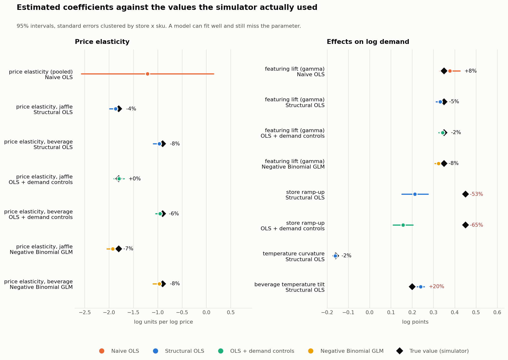
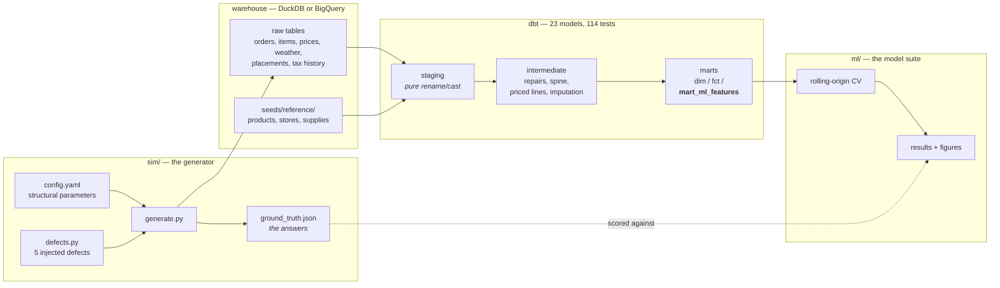
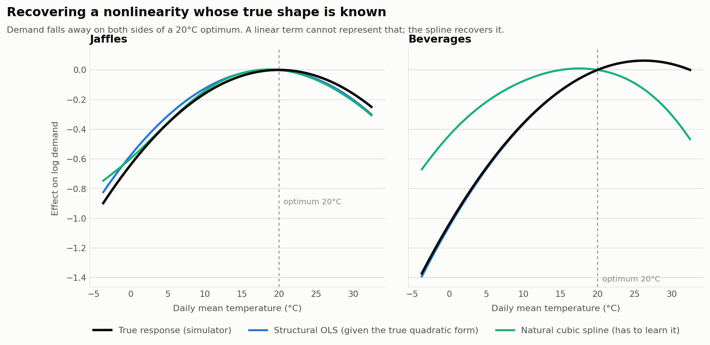

# Jaffle Demand Lab

**A demand-forecasting pipeline where the ground truth is known — so models are scored on whether they're *right*, not just on whether they fit.**

<!--
  CI badge: once this repo is pushed to GitHub, swap YOUR_USERNAME below and uncomment.
  Left commented deliberately — a badge pointing at a repo that does not exist yet
  renders as a broken image on the first screen of the README, which is worse than
  having no badge at all.

  [](https://github.com/YOUR_USERNAME/jaffle-demand-lab/actions/workflows/ci.yml)
-->

`dbt build` → **137 passed, 3 expected warnings, 0 errors** · `pytest sim/tests` → **9 passed** · `ruff` → clean · every figure and table below regenerates from a fixed seed, so the numbers reproduce exactly.

A simulator generates three years of store transactions — 687k orders, 984k order lines, 6 stores — from a demand system with a **known** price elasticity, a **known** promotion lift, a **deliberately confounded** treatment assignment, and five injected data-quality defects. dbt repairs the defects and builds a tested, point-in-time-correct feature mart. Nine models are then benchmarked under rolling-origin cross-validation and, crucially, against the coefficients the simulator actually used.

With a public dataset you can only ever report R². Here I can report whether the model recovered the parameter — and for two of the six parameters, the answer is no.



---

## Results in 30 seconds

Held-out RMSE, mean over 4 expanding-window folds. Baseline is a seasonal-naive forecast (store × sku × weekday mean).

| Model | RMSE | vs baseline | 95% CI on RMSE | Price elasticity recovered? |
|---|---:|---:|---|---|
| Seasonal naive (baseline) | 14.57 | — | [11.74, 17.07] | — |
| Store × sku mean | 14.95 | +2.7% | [12.08, 17.61] | — |
| **OLS, naive spec** | **18.62** | **+27.8%** | [14.54, 22.48] | ✗ one pooled number where two exist |
| OLS, structural spec | 12.20 | −16.3% | [10.16, 14.06] | ✓ jaffle within **3.7%** |
| OLS + demand controls | 11.94 | −18.1% | [9.85, 13.84] | ✓ jaffle within **0.2%** |
| Negative Binomial GLM | 12.07 | −17.1% | [9.93, 13.98] | ✓ within 6.8% (CI misses) |
| OLS + temperature splines | 12.18 | −16.4% | [10.16, 14.03] | ✓ |
| **ElasticNet** | **11.88** | **−18.5%** | [9.71, 13.83] | ✗ shrunk — see below |
| LightGBM (Poisson) | 12.06 | −17.2% | [9.80, 14.13] | n/a |

**On the 90-day final holdout** (scored once, at the very end): best model 8.92 RMSE, **38.2% below baseline**.

Five findings, each a number:

1. **A misspecified regression lost to a weekday average — by 28%.** The naive specification has forty features and still scores worse than the baseline, because it omits SKU fixed effects while SKU popularity varies four-to-one between beverages and jaffles. Adding structure the data actually has moves it from +27.8% to −16.3% in one step. Feature count is not the same as specification.

2. **The promotion lift is understated by 5.2%, and controls cut that to 2.1%.** Featured placements aren't randomly assigned — stores schedule them when trailing demand is weak, and the underlying demand shock persists (AR(1), ρ = 0.90). Conditioning on lagged demand halves the bias but does not remove it: a proxy is not the confounder.

3. **The controls that fix one coefficient destroy another.** The same lagged-demand features drag the store ramp-up coefficient from −52.8% error to **−65.2%** — they are slow-moving, so they absorb a slow-moving structural effect. No single specification was best for every parameter.

4. **How you impute matters more than whether you impute.** Weather is missing on 4.1% of rows, and missing seven times more often on temperature extremes. Filling from each store's monthly climatology costs **1.7%** on the temperature curvature; filling from a single global mean costs **12.6%**. Same data, same model, same missingness — one line of SQL apart.

5. **Random K-fold would have overstated accuracy by 6.1%**, measured against a rolling fold of matched training size (see the note in the leakage section — the naive comparison gives a different number for the wrong reason).

Two more, reported because they're true rather than because they're flattering: **gradient boosting did not beat the hand-specified OLS**, and the bootstrap intervals on the six leading models overlap almost entirely, so the honest statement is that they are indistinguishable at this sample size. And the **ElasticNet has the best CV error while its price elasticity is visibly shrunk** — the shrinkage path below shows the coefficient walking from −1.78 to zero as the penalty rises.

Full numbers: [`reports/results.md`](reports/results.md). Calibration: [`reports/calibration.md`](reports/calibration.md).

### Where to look first

If you have five minutes and want to judge the work rather than read about it:

| File | Why |
|---|---|
| [`sim/config.yaml`](sim/config.yaml) | The entire data-generating process in one annotated file, including the confounder and why it needs to persist to bias anything |
| [`models/marts/mart_ml_features.sql`](models/marts/mart_ml_features.sql) | Point-in-time feature construction — every rolling window framed to end before its own target |
| [`tests/assert_no_feature_leakage.sql`](tests/assert_no_feature_leakage.sql) | The leakage guard written as a data test rather than a code comment |
| [`ml/run.py`](ml/run.py) | The evaluation harness: rolling-origin CV, coefficient recovery, the leakage and imputation experiments |

---

## Architecture



`ground_truth.json` reaches the evaluation step and **never** the feature mart. The latent demand shock that confounds the promotion effect is never written to the warehouse at all — a test asserts it (`sim/tests/test_generate.py::test_latent_shock_is_not_leaked`).

---

## Why simulated data

The usual objection is that synthetic data is a shortcut. Here it's the opposite — it's a harder grading criterion, and it makes four things possible that a public dataset does not:

- **Parameter recovery as a metric.** Every model reports its estimated elasticity next to the real one. Two models can tie on RMSE while only one is right about why demand moves; that distinction is invisible on Kaggle and it is the single most useful thing in this repo.
- **Confounding you can verify.** Promotion assignment depends on recent performance, and a persistent unobserved demand shock sits in the error term. The bias has a known sign and a known size, so "I controlled for it" becomes a claim that can be checked rather than asserted.
- **Nonlinearity with a known shape**, which produced a result I did not expect — see the temperature figure below.
- **Data-quality defects that are real, because they were put there.** Five of them, each paired with the test that catches it.

**And it is calibrated, not invented.** The store catalogue, the ten SKUs and the 65-row bill of materials are the real Jaffle Shop reference data. Three distributions are fitted to the 686 genuine orders in [`calibration/real_seeds/`](calibration/real_seeds/) — and the real data corrected two of my assumptions: the shop is **80% beverages**, not an even split, and its peak is **7–9am**, not lunch.

| Check | Status | Real | Simulated | KS D |
|---|---|---:|---:|---:|
| Mean items per order | calibrated | 1.453 | 1.446 | 0.030 |
| Beverage share of units | calibrated | 80.7% | 80.6% | TVD 0.042 |
| Orders before 10am | calibrated | 50.4% | 50.2% | 0.050 |
| **Median order value** | **emergent** | $6.36 | $8.43 | 0.339 |
| **90th-percentile order value** | **emergent** | $21.20 | $21.54 | (as above) |

Only the last two are evidence of anything: order value was never fitted — it falls out of basket size × SKU mix × catalogue prices. The upper tail lands within 2%; the middle sits 33% high, which is what three years of simulated inflation off a 2016 catalogue and regional multipliers up to 1.14 should do. Reported as it came out.

### What is *not* claimed

The simulator is my model of a retail demand process, so every model here is ultimately graded against my assumptions. Elasticity is held constant over three years, which real pricing data would not be. The real sample used for calibration is one store over sixteen days in 2016 — enough to anchor the shape of a distribution, not enough to validate a six-store three-year simulation. This project demonstrates modelling and validation discipline; it does not demonstrate that these elasticities are true of any actual jaffle shop.

---

## Quickstart

No cloud account needed. The `dev` target is a local DuckDB file.

```bash
pip install -r requirements.txt
cp profiles.yml.example profiles.yml

python -m sim.generate                    # ~35s -> data/jaffle.duckdb + ground_truth.json
dbt deps && dbt build --profiles-dir .    # ~15s -> 23 models, 114 data tests
python -m ml.calibration                  # ~5s  -> reports/calibration.md
python -m ml.run                          # ~6m  -> reports/results.md + figures
```

### What a correct run looks like

```
Done. PASS=137 WARN=3 ERROR=0 SKIP=0 NO-OP=0 TOTAL=140
```

**The three warnings are supposed to be there.** Two report the duplicate-order rate at
source and in staging; one flags a store-month where weather imputation exceeds a
quarter of rows. They are the tests keeping the injected defect rates visible on every
build. The tests that would *error* are the ones guarding the repairs — if any of those
fires, something is genuinely wrong.

Everything is seeded (`seed: 20260914` in `sim/config.yaml`), so a clean clone produces
the same 686,555 orders, the same coefficient estimates and the same figures. If your
numbers differ from the tables above, the pipeline has changed, not the dice.

<details>
<summary>Running it on BigQuery instead</summary>

```bash
export DBT_GCP_PROJECT=your-project DBT_GCP_KEYFILE=~/.keys/dbt.json
python -m sim.load_bigquery --dataset jaffle_sim_raw
dbt build --target bigquery \
  --vars '{raw_database: your-project, raw_schema: jaffle_sim_raw}'
```

Every model is written in cross-dialect SQL. The two places the warehouses genuinely disagree — weekday numbering and the cents-to-dollars cast — are handled by adapter-dispatched macros in `macros/`, not by two copies of the SQL.
</details>

---

## The model ladder

Each step exists because the previous one raised a question.

**0 · Baselines.** Seasonal-naive (store × sku × weekday mean) and a store × sku mean. Both forecast the whole test window from training data alone. Without them, "RMSE 11.9" means nothing.

**1 · OLS, naive specification.** One pooled price coefficient, a linear temperature term, store and weekday effects, `is_featured` entered without a thought about why it was switched on. **Loses to the baseline by 27.8%**, and its pooled elasticity confidence interval spans −2.57 to +0.15 — it cannot even sign the effect.

**2 · OLS, structural specification.** Elasticity interacted with product type, quadratic temperature, SKU fixed effects. Recovers the jaffle elasticity to within **3.7%** and the temperature curvature to within **1.7%**.

**3 · OLS + lagged demand controls.** Adds trailing 7- and 28-day demand at both SKU and product-type level to proxy for the unobserved shock driving promotion assignment. Cuts the promotion bias from 5.2% to 2.1%, lands the jaffle elasticity within **0.2%** — and takes the store ramp-up coefficient from −53% to −65%.

**4 · Negative Binomial GLM.** Chosen on evidence: the Poisson Pearson χ²/df is **4.80** (it would be 1.0 if the variance assumption held), so Poisson is rejected and NB dispersion is estimated at 0.195. It also models log E[y] directly rather than E[log y], which means zero-sales days stay in the sample instead of being dropped to make the logarithm defined.

**5 · Temperature splines.** Natural cubic splines replacing the quadratic term. See the figure below — the result is not the one I expected.

**6 · ElasticNet**, penalty chosen by `TimeSeriesSplit` rather than shuffled K-fold, because choosing a hyper-parameter on randomly shuffled folds is the same leakage the rest of the project avoids, just hidden inside model selection.

**7 · LightGBM, Poisson objective.** Counts with variance growing in the mean, so squared error is the wrong loss. No hand-built interactions. Does not beat step 3.

Standard errors are clustered at store × sku throughout. The shock is a store × product-type process, so store-level clustering would be the textbook choice — but there are only **six stores**, and cluster-robust variance is a large-sample result in the number of clusters. Store × sku gives 60 clusters at the cost of missing cross-SKU dependence, which is a stated limitation and the argument for a mixed-effects model.

---

## The result I didn't expect



I built the spline expecting to show that a flexible method recovers a nonlinearity a linear term can't. It didn't work out that way. The structural OLS contains the true quadratic form *by construction* — I knew the data-generating process, so I gave it the right shape — and it tracks the truth almost exactly. The spline has to learn the shape, and on beverages, where the type interaction rests on less data, it misplaces the optimum by about nine degrees.

The lesson isn't that splines are bad. It's that a flexible method needs more data per effect than a correctly specified parametric term, and that in any real problem you don't get handed the correct form. Both halves of that are worth more than a chart confirming what everyone already assumes.

---

## Regularisation: what shrinkage costs

The interesting result is not that ElasticNet has the best CV error by a margin the confidence intervals can't distinguish. It's what the penalty does to the coefficients underneath:

| Lasso α | Estimated jaffle elasticity | Features kept |
|---:|---:|---:|
| 0.0001 | −1.78 | 35 |
| 0.001 | −1.63 | 31 |
| 0.005 | −1.13 | 29 |
| 0.02 | −0.27 | 15 |
| 0.05 | **0.00** | 9 |

True value: **−1.80**. Regularisation buys variance reduction by paying in bias, and the bill lands on exactly the coefficient the project is trying to recover.

Stability selection over 60 bootstrap resamples — resampled by store × SKU *series*, not by row, because rows within a series are serially correlated — finds **8 of 35** features selected between 20% and 80% of the time. Reading a single Lasso fit as a list of important variables would be reading noise.

---

## Validation

- **Rolling-origin, expanding-window CV.** Four folds, 60-day test windows. No fold sees its own future.
- **A 90-day final holdout, scored exactly once**, after all model and feature decisions were fixed.
- **The leakage experiment, matched on training-set size.** Random K-fold trains on 75% of the data every time; the *first* rolling fold trains on far less, so comparing K-fold against the mean across all folds confuses leakage with sample size (it gives 1.7%). Against the last rolling fold, which trains on comparable volume, K-fold is optimistic by **6.1%**. Both numbers are in the report; the matched one is the honest one.
- **A leakage guard as a data test.** `tests/assert_no_feature_leakage.sql` independently recomputes every trailing window with a frame ending at `1 preceding` and fails if the mart disagrees.
- **Reconciliation to source.** `tests/assert_order_revenue_reconciles.sql` asserts priced line items sum to the subtotal the source recorded, per order, to the cent — and is what independently proves the unit-slip repair worked.
- **Metrics chosen, not defaulted.** RMSE, MAE, sMAPE and signed bias. Plain MAPE is excluded on purpose: some store-SKU-days sell nothing, and MAPE would either explode or silently force the hardest rows out of the comparison.
- **Differences tested, not just observed.** Bootstrapped 95% intervals on every model's fold-mean RMSE. The six leading models overlap; the gap to the baselines does not.

### Diagnostics: which assumptions fail

| Assumption | Statistic | Verdict | What was done |
|---|---|---|---|
| Heteroskedasticity | Breusch-Pagan LM = 878 | **violated** | Cluster-robust SEs at store × sku |
| Serial correlation | DW = 1.893, ACF(1) = 0.053 | **violated** | Expected — the latent shock is in the error by construction. Clustering plus lagged controls absorb part of it |
| Normality | Jarque-Bera = 3,912, skew −0.63 | **violated** | Not acted on. OLS is unbiased without it and n = 46k covers the inference; it would matter for prediction intervals, which is why those come from quantile methods |
| Multicollinearity | VIF: trailing-28d = 80.7 | **violated** | Kept deliberately — dropping either window weakens the de-confounding. The cost is unstable coefficients, which stability selection quantifies |
| Influential points | 4.85% above Cook's 4/n | ok | No rows removed; these are real high-demand days |

## Data quality by design

Five defects, injected deliberately in [`sim/defects.py`](sim/defects.py), each paired with the test that catches it and the model that repairs it. This is a more honest answer to "have you handled messy data?" than any claim about a public dataset.

| Defect | Caught by | Repaired in |
|---|---|---|
| 2,722 duplicate order rows from a till double-submit — line items *not* duplicated, so joining before deduplicating inflates revenue plausibly | source `unique` (warn) + `unique` on the repaired model (error) | `int_orders_repaired` |
| One store-month with the cents conversion applied twice — still positive, still numeric, invisible to a range check | `assert_order_revenue_reconciles` — line items are an independent source the slip never touched | `int_orders_repaired` |
| Refunds carried as negative totals with no line items | `accepted_range` on the repaired subtotal | routed to `stg_jaffle_shop__refunds` |
| Weather missing **MAR, not MCAR** — 16.1% of extreme days vs 2.3% of normal days | `assert_weather_coverage` (warn) | `int_weather_imputed`, with a flag carried to the mart |
| Late-arriving orders: `loaded_at` days after `ordered_at` | `assert_load_lag_is_bounded` (warn) | not hidden — the lag is exposed, not assumed away |
| Tax rate changes mid-series, while the catalogue models it as static | `assert_tax_matches_rate_in_effect` | `stg_jaffle_shop__tax_rate_changes` with as-of join |

Plus two defects found in the *original* Jaffle Shop reference data, not injected: zero-sales store-SKU-days that a naive `GROUP BY` silently drops (guarded by `assert_spine_is_gapless`), and `supply_id` not being a primary key — 65 rows, 29 distinct ids — which the upstream workshop project declared `unique`, a test that cannot ever have passed.

---

## Repo map

```
sim/                   config.yaml (every parameter), generate.py, defects.py,
                       load_bigquery.py, ground_truth.json (the answers),
                       tests/ (9 property tests)
models/                dbt: staging -> intermediate -> marts, mart_ml_features last
tests/                 7 singular dbt tests: reconciliation, leakage guard, spine
                       gaplessness, unit-slip repair, tax-rate-in-effect, weather
                       coverage, load lag
macros/                adapter-dispatched SQL for the two things DuckDB and
                       BigQuery genuinely disagree on
seeds/reference/       the real product, store and supply catalogue
calibration/real_seeds/ the 686 real Jaffle Shop orders, kept as calibration evidence
ml/                    features, splits, metrics, diagnostics, calibration,
                       models/, run.py. Nothing is defined inside a notebook cell
reports/               results.md, calibration.md, metrics.json, figures/
docs/                  the original workshop brief this project grew out of
.github/workflows/     CI: ruff, the simulator tests, and a full dbt build on DuckDB
profiles.yml.example   copy to profiles.yml; DuckDB by default, BigQuery optional
```

Data lives in `data/` and is gitignored — it is generated, never committed, and
`python -m sim.generate` rebuilds it byte-for-byte.

## What I'd do next

In rough order of what each would actually buy:

1. **An instrument for promotion assignment.** Lagged demand only proxies the shock and leaves ~2% bias. The assignment rule is deterministic given trailing demand, so a regression-discontinuity design around the weak-week threshold should identify the lift cleanly.
2. **Mixed effects.** Random intercepts and random price slopes by store would handle the cross-SKU dependence that six clusters cannot, and partial pooling should beat both extremes for the two youngest stores.
3. **Quantile or conformal prediction intervals.** A demand forecast without an interval can't drive an inventory decision — and for perishable stock the loss is asymmetric, so P90 is the number that matters, not P50.
4. **Point-in-time features keyed on `loaded_at`, not `ordered_at`.** The late-arrival lag is exposed but not yet used; building features as of the load date would close the last gap between this backtest and what production would actually have seen.

---

<sub>Built on the dbt Labs Jaffle Shop reference data. The original University of Birmingham workshop brief this project started from is preserved in [`docs/workshop_brief.md`](docs/workshop_brief.md).</sub>
